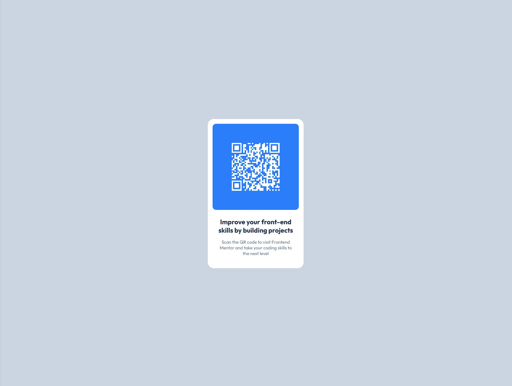

# Frontend Mentor - My QR code component solution

This is my solution to the [QR code component challenge on Frontend Mentor](https://www.frontendmentor.io/challenges/qr-code-component-iux_sIO_H).

## Table of contents

- [Overview](#overview)
  - [Screenshot](#screenshot)
  - [Links](#links)
- [My process](#my-process)
  - [Built with](#built-with)
  - [What I learned](#what-i-learned)
  - [Continued development](#continued-development)
- [Author](#author)

**Note: Delete this note and update the table of contents based on what sections you keep.**

## Overview

### Screenshot

[Screenshot Desktop Version](./screenshots/screenshot_desktop.jpg)
[Screenshot Mobile Version](./screenshots/screenshot_mobile.jpg)

### Links

- Solution URL: [Solution URL](https://github.com/ddg-dev/FM-qrcode-component)
- Live Site URL: [Live site URL](https://ddg-dev.github.io/FM-qrcode-component/)

## My process

### Built with

- Semantic HTML5 markup
- CSS custom properties
- Flexbox
- NodeJS
- [NPM Library](https://www.npmjs.com/package/qrcodejs) - QRCode.js

### What I learned

I used NodeJS and the NPM Library QRCode.js for generating a QRCode from an URL.
I did the same design for the Desktop and Mobile versions by using Flexbox.

### Continued development

For my next projects, this NPM Library [NPM Library](https://www.npmjs.com/package/qrcodejs) - QRCode.js will help me a lot.
Next times I will let the user make his QRCode by typing an URL or a text or an image, perhaps ?

## Author

- GitHub - [ddg-dev](https://github.com/ddg-dev)
- Frontend Mentor - [@ddg-dev](https://www.frontendmentor.io/profile/ddg-dev)
- LinkedIn - [Dany Da Graça](https://www.linkedin.com/in/dany-da-graca/)